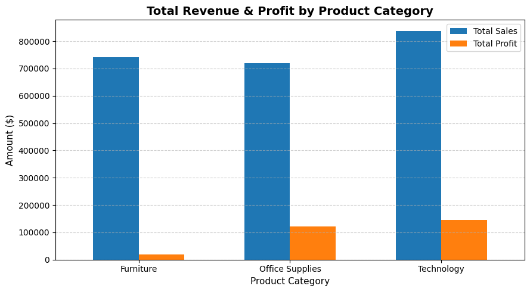

# ecommerce-sales-analysis
# E-Commerce Sales Trends & Customer Performance Analysis

## Overview
This project analyzes over 9,000 transaction records from an e-commerce retail store using Excel, SQL, and Python. The objective is to identify top revenue-generating product categories, profit margins, and sales distributions across customer segments and regions.

---

## Key Business Insights
* **Top Revenue Category:** Office Supplies and Technology generated the highest total sales, with Technology maintaining the highest profit margin overall.
* **Profitability Watch:** Furniture generated high top-line revenue but exhibited lower net profit margins due to higher underlying costs and discounts.
* **Customer Segment Performance:** Consumer segment orders drive the majority of regional volume, followed closely by Corporate accounts.

---

## Visualizations


---

## Project Structure
```text
ecommerce-sales-analysis/
│
├── data/
│   ├── superstore.csv          # Raw input dataset
│   └── cleaned_superstore.csv  # Processed dataset
│
├── notebooks/
│   └── data_analysis.ipynb     # Python cleaning & plotting script
│
├── sql/
│   └── sales_queries.sql       # Aggregation & analysis SQL queries
│
└── outputs/
    └── sales_chart.png         # Generated visual chart
